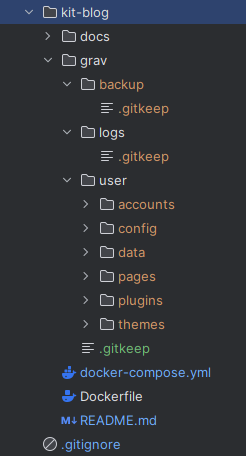

# kit-blog

This module is the blog module of the website. For now, this module is containing the necessary to test Grav CMS.

## How to test

### Windows
Install Docker Desktop on your computer. Open a terminal in this current folder and then, start the containers:
```bash
docker-compose up -d
```
It will start the kit-blog project with a Grav CMS container.

Just go to http://localhost:8080 to see the result.

After that, you will have a folder structure like this:


